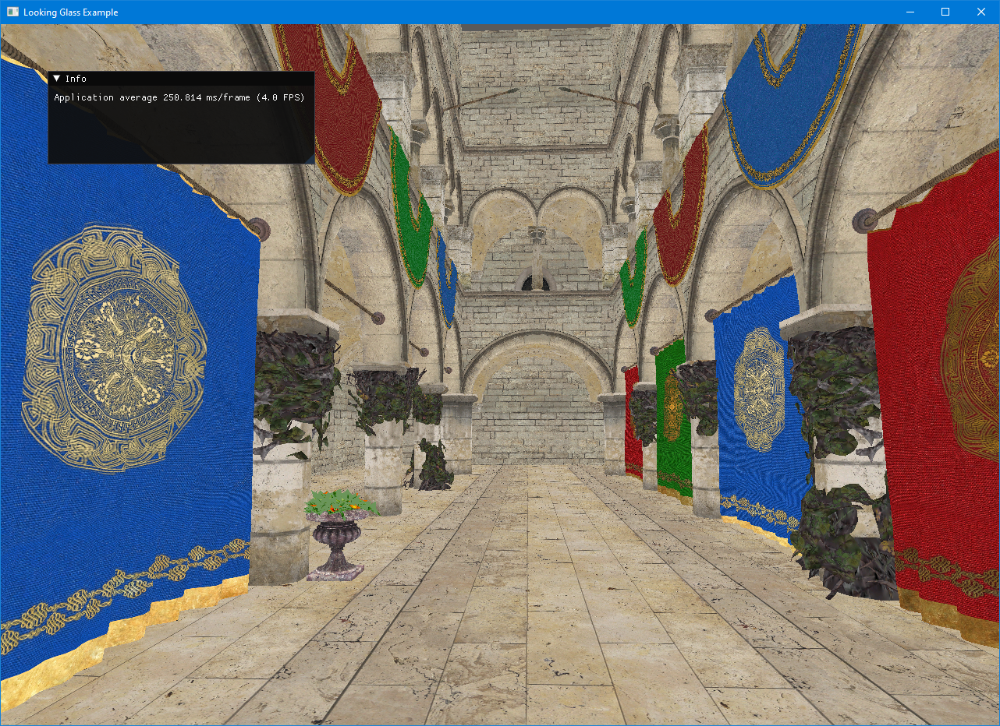
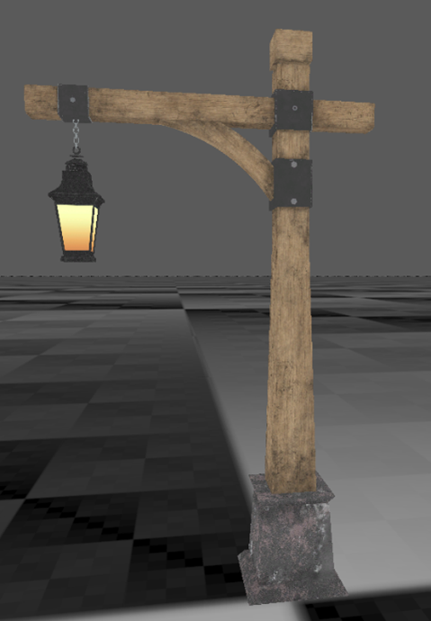
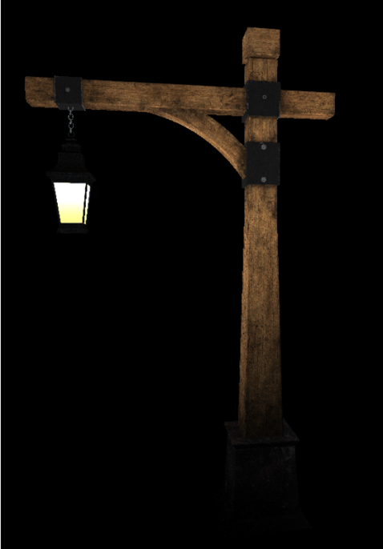
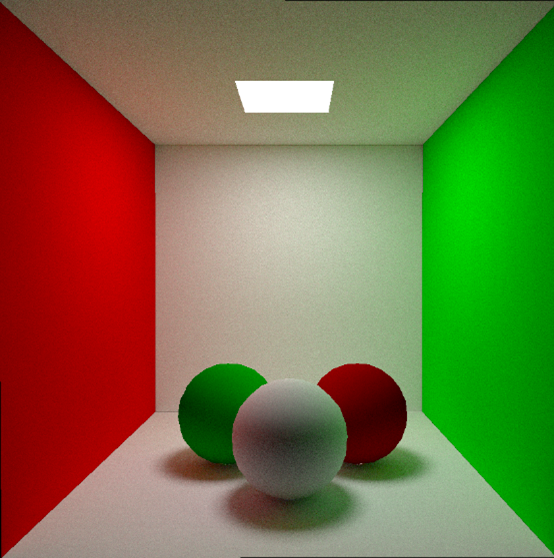
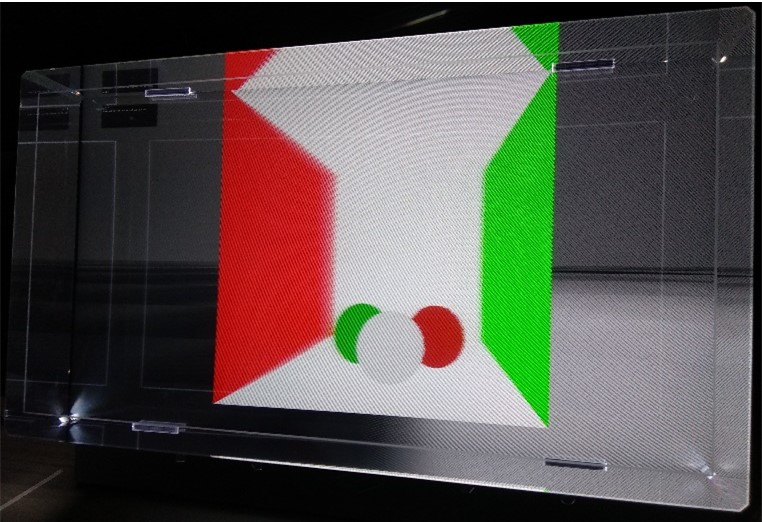
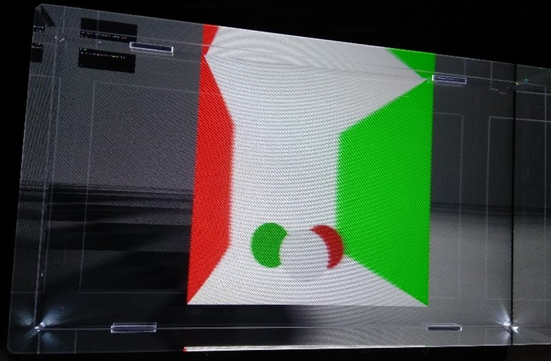
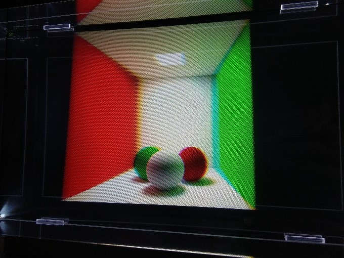
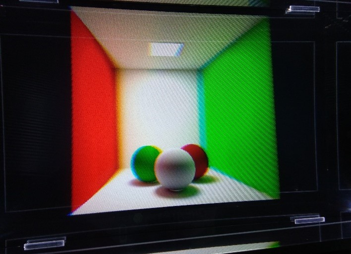

# Path Tracer for Looking Glass display
> Multiwindow multithreaded scene rendering example.  
*Shoot rays through your Looking Glass.*

Yet another quick school project.

## Features
- Automatic Looking Glass calibration
	- through Holoplay.js if you have Looking Glass Bridge application running and Node.js installed
	- through good old USB interface as a fallback
	- Looking Glass rendering works correctly only in full screen mode (press `f`)
- Loading scenes (many supported formats through [assimp](https://github.com/assimp/assimp) but optimized for glTF format with no embedded textures)
- Non-realtime path tracing
- Realtime ray tracing
- Example Cornell Box scene (cornellBox.glb)
- Input processing on one thread and rendering on another thread (event queue synchronization may be slow, but VS profiler shows 'not that much'🙃)
- Works even if you set display scaling different than 100% (like me)
- Acceleration of triangle rendering by using BVH and Embree-like triangle data structure

## Build
- There aim was to make this project portable, but it was tested only on Windows 10 x64 with GTX 1050 Mobile
- Install [CMake](https://cmake.org/), [vcpkg](https://vcpkg.io/) and [node](https://nodejs.org/en/).
- Setup `vcpkg` by running
	- `.\vcpkg\bootstrap-vcpkg.bat` or `.\vcpkg\bootstrap-vcpkg.sh` in the directory where you cloned `vcpkg`
	- this will also print your toolchain file path `something.../vcpkg.cmake`
	- If you are using Visual Studio, you can also `vcpkg integrate install`
- clone this repo `git clone git@github.com:OSDVF/LookingGlassPT.git`
- `cd LookingGlassPT`
- `mkdir build && cmake -B./build -S. -DCMAKE_TOOLCHAIN_FILE=[path to vcpkg]/scripts/buildsystems/vcpkg.cmake`
- or for the Visual Studio: add CMakePresets.json. Example:
```json
{
  "version": 3,
  "configurePresets": [
    {
      "name": "windows-base",
      "hidden": true,
      "generator": "Ninja",
      "binaryDir": "${sourceDir}/out/build/${presetName}",
      "installDir": "${sourceDir}/out/install/${presetName}",
      "cacheVariables": {
        "CMAKE_C_COMPILER": "cl.exe",
        "CMAKE_CXX_COMPILER": "cl.exe",
        "CMAKE_TOOLCHAIN_FILE": "C:/vcpkg/scripts/buildsystems/vcpkg.cmake"
      },
      "condition": {
        "type": "equals",
        "lhs": "${hostSystemName}",
        "rhs": "Windows"
      }
    }
}
```

### Note
The executable directory (conatining LookingGlassPT.exe) will be different than the build directory (containing CMakeCache.txt, node_modules...)
**when building under MSBuild**. It is the required to run the application with the **build directory** as the working directory or it will crash because
of not finding required shaders (vertex.vert & fragment.frag) and calibration script (index.js).

## Run
There are two windows
- Control window for changing program settings variables (e.g. switching between flat screen and looking glass)
- Rendering window
Optional program arguments
- `d` display debug console
- `flat` skip initial the searching for a connected looking glass and use flat screen directly

## Controls
The left window is a "control window". You can set scene parameters there.
### Noteworthy scene settings
- Scale - the program does not check the scene for correct scaling. You must set correct scaling here. For the cornellBox.glb scene the correct scaling is 10x (1 when using logarithmic scale)
- When using Logarithmic Scale: 0 -> 1x, 1 -> 10x, 2 -> 100x, -1 -> 0.1x
- Maximum Object Count: although this project uses BVH for triangle rendering acceleration, the complexity scales with large number of triangles. Try to reduce the object count if you have problems.  
The count of individual triangles can't be set currently.
### Keyboard
The program has several interactive features which can be turned on by pressing keys when the right "rendering window" is focused.
- `i` - Toggles interactive mode: W, A, S, D, Space for move, Shift for higher speed, Mouse for look around
- `l` - Toggles between Looking Glass and Flat Screen mode
- `Escape` - Hides the rendering window
- `p` - Toggles power save mode - renders frames only when moving mouse or touching keyboard
- `f` - Full screen - required when using Looking Glass as the output format
- `r` - Recompile shaders - the shaders (vertex.vert, fragment.frag) are loaded from the working directory. You can edit them in the runtime and apply your changes instantly using this.  
As a fallback, shaders from the executable directory are used (if it is different than the working directory).

## Screenshots
  
[Sponza scene](https://github.com/KhronosGroup/glTF-Sample-Models/tree/master/2.0/Sponza/glTF)(only 80 objects) running on RTX 4090  
  
[Lantern scene](https://github.com/KhronosGroup/glTF-Sample-Models/tree/master/2.0/Lantern) running at GTX 1050 Mobile  
  
Lantern scene in path tracing mode  

### Cornell Box
  
Cornell box scene in path tracing mode  
  
Cornell box scene ray traced on looking glass  
  
Different view  

### Path tracing
  
Cornell box scene path traced on looking glass (different subpixel handling not functional yet)  
  
Different view

## Dependencies
- C++ 20
- System with OpenGL 4.3 and bindless texture support (ARB_bindless_texture) ([find your GPU support here](https://opengl.gpuinfo.org/))
- [CMake](https://cmake.org/)
- [vcpkg](https://vcpkg.io/)
- [node](https://nodejs.org/en/) - only for calibration via [Holoplay.js](https://www.npmjs.com/package/holoplay)
- node modules (managed automatically by `npm`)
	- holoplay
	- mock-dom-resources
	- three
	- ws

- C++ libraries (managed automatically by `vcpkg`)
	- `glew`
	- `glm`
	- `sdl2`
	- `imgui`
	- `libusb` - for calibration via USB
	- `nlohmann-json` - for parsing calibration data
	- `tiny-process-library`
	- `assimp`
	- `stb` - for loading scene textures 
	- `nativefiledialog` - for the selection of scene file
	- `boost-stacktrace` - for nice debug info

# Thanks to
- [Department of Computer Graphics and Multimedia at FIT BUT](https://www.fit.vut.cz/units/upgm/.en) - for borrowing me a Looking Glass display and ray generation algorithm
- [kayru/RayTracedShadows](https://github.com/kayru/RayTracedShadows) - BVH inspiration
- [3DApps](https://github.com/dormon/3DApps) - LG USB Calibration
- [Embree-style Möller-Trumbore ray-triangle intersection](https://www.shadertoy.com/view/llGSDD)
- [Scene loading](https://github.com/assimp/assimp/blob/master/samples/SimpleTexturedOpenGL/SimpleTexturedOpenGL/src/model_loading.cpp) - assimp example
- [Tutorial about bindless textures](https://sites.google.com/site/john87connor/indirect-rendering/2-a-using-bindless-textures?pli=1)
